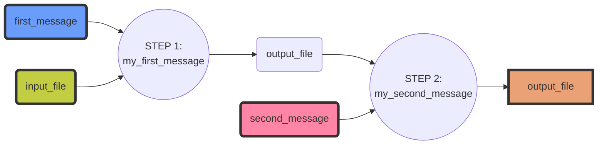

# Arvados CWL Tester Playground

Welcome to the Arvados CWL Tester Playground! This is a sample project to help you learn how to use [Arvados CWL Tester](https://github.com/arvados/arvados_cwl_tester) framework to test CWL code.

## Overview

The Arvados CWL Tester is an open-source testing framework that lets you write tests in Python and execute on Arvados. Arvados is a modern open source platform for managing and processing large biomedical data (more information you can find [here](https://arvados.org/)).
The framework supports parallel execution of multiple tests using pytest. 

This playground project includes simple CWL workflow with 2 steps and a Python testing script that uses the Arvados CWL Tester. 

Diagram representing **my_first_workflow**:



You can use this project as a starting point to create your own tests for your own CWL workflows. 

## Getting started

### Install Arvados CWL Tester

First install arvados_cwl_tester framework according to [instructions](https://github.com/arvados/arvados_cwl_tester#installation)


### Configure Access to Arvados

Before you can run the tests in this project you need to create an account on the [Arvados Playground](https://workbench.pirca.arvadosapi.com//)

1. Create and account on the Arvados [Arvados Playground](https://workbench.pirca.arvadosapi.com//)
2. Log into Arvados Workbench and copy [API TOKENS](https://workbench.pirca.arvadosapi.com/current_token)
3. Open a new terminal window and paste your API TOKENS


### Run a tests

Run all tests in parallel:
```bash
$ pytest --workers 10 --tests-per-worker auto -s 
```

Run some single test:
```bash
$ pytest -s -k my_first_workflow_provided_messages
```

### Go to arvados workbench

Have a look into the project you used for testing and find you testing [subproject](https://workbench2.pirca.arvadosapi.com/projects/pirca-j7d0g-b05ocf2z1ak34yx)


   

